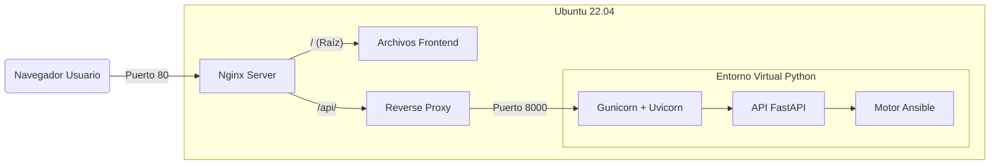

## 🟦 Ansible Visual Project
Objetivo: Crear una interfaz visual basada en nodos (estilo Blueprints de Unreal Engine) para generar y ejecutar playbooks de Ansible, simplificando la infraestructura como código (IaC).

## 👥 Equipo y Colaboradores

¡Las personas que hacen posible este proyecto!

| Nombre | Rol / Especialidad | GitHub |
| :--- | :--- | :--- |
| **Juan Fco. Entrena Garrido** | xxxxx | [@JuanEntrena18] |
| **Diego Toribio Perea** | xxxxx | [@DIEGO1ASIRC] |
| **Daniel Palacios Melguizo** |xxxxx | [@dpalmel1312] |
| **Marina Jiménez Egea** | xxxxx | [@Marjieg] |
| **Félix David Romero López** | xxxxx | [@felixdavid28] |

## 🚀 Fase 1: Infraestructura y Arquitectura Base
En esta fase se ha establecido los cimientos del servidor, la seguridad y la tubería de comunicación completa entre el Frontend y el Backend. Se ha configurado un entorno de producción "Bare Metal" en Ubuntu 22.04 antes de la futura contenerización con Docker.

### 🏗️ Stack Tecnológico (Estado Actual)
OS: Ubuntu Server 22.04 LTS.

Web Server / Proxy: Nginx.

Backend API: Python (FastAPI + Uvicorn + Gunicorn).

Process Manager: Systemd.

IaC Engine: Ansible Core.

Frontend (Base): HTML/JS (Sirviendo estáticos vía Nginx).

### ⚙️ Arquitectura del Sistema
El sistema utiliza Nginx como punto de entrada único (Reverse Proxy) para gestionar tanto la entrega de la aplicación visual como las peticiones a la API, evitando problemas de CORS y simplificando la exposición de puertos.

### 🔧 Detalles de Configuración
1. Estructura de Directorios
Backend: /opt/ansible-visual/api (Propiedad del usuario, entorno virtual venv aislado).

Frontend: /var/www/ansible-visual/html (Archivos estáticos servidos por Nginx).

## 2. Configuración Nginx (Reverse Proxy)
Nginx redirige el tráfico de /api/ internamente al servicio de Python.

´´´bash
server {
    listen 80;
    root /var/www/ansible-visual/html;
    index index.html;

    location / {
        try_files $uri $uri/ /index.html;
    }

    location /api/ {
        proxy_pass http://127.0.0.1:8000/;
        proxy_set_header Host $host;
    }
}
´´´

---
