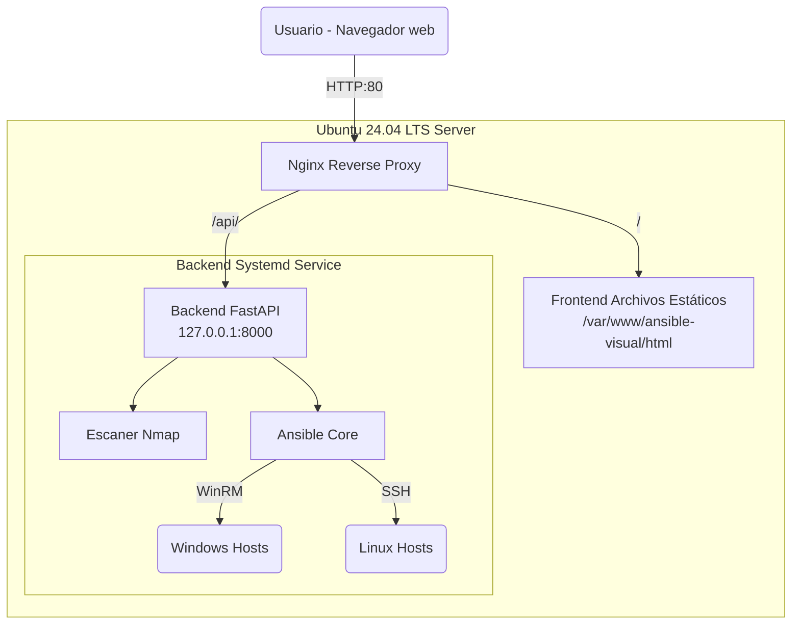

# Visual /\nsible Project

Objetivo: Crear una interfaz visual basada en nodos para generar y ejecutar playbooks de Ansible, simplificando la infraestructura como código (IaC).

## 👥 Equipo y Colaboradores

¡Las personas que hacen posible este proyecto!

| Nombre | GitHub |
| :--- | :--- |
| **Juan Fco. Entrena Garrido** | [@JuanEntrena18] |
| **Diego Toribio Perea** | [@DIEGO1ASIRC] |
| **Daniel Palacios Melguizo** | [@dpalmel1312] |
| **Marina Jiménez Egea** | [@Marjieg] |
| **Félix David Romero López** | [@felixdavid28] |

## 1. Infraestructura y Arquitectura Base

### Stack Tecnológico
- **OS**: Ubuntu Server 24.04 LTS
- **Web Server / Proxy**: Nginx
- **Backend API**: Python (FastAPI + Uvicorn/Gunicorn)
- **Procesos y Servicios**: Systemd
- **Motor IaC**: Ansible Core
- **Escaneo de Red**: Nmap
- **Frontend**: HTML/JS (Archivos estáticos servidos por Nginx)

### Arquitectura del Sistema

La arquitectura está diseñada para tener Nginx como punto de entrada único (Reverse Proxy). Esto nos permite servir la aplicación web estática y redirigir el tráfico de la API al backend en Python, evitando problemas de CORS y mejorando la seguridad general.



### Detalles de Configuración
Las rutas principales dentro del servidor donde se despliega el proyecto son:
- **Backend API**: `/opt/ansible-visual/api` (entorno virtual de Python `venv` aislado)
- **Frontend**: `/var/www/ansible-visual/html`
- **Motor Ansible**: `/opt/ansible-visual/ansible` (Playbooks, inventarios y logs)
- **Credenciales y Configuración**: `/opt/ansible-visual/credentials.json`

## 2. Configuración del proxy inverso Nginx

Nginx actúa como el servidor web y proxy inverso principal. Su labor fundamental es recibir peticiones por el puerto 80 y decidir su destino:
- Las peticiones a la ruta raíz (`/`) sirven la interfaz frontend.
- Las peticiones a `/api/` se reenvían al servicio interno de FastAPI en el puerto `8000`.

**Configuración clave destacada:**
Para que la salida de las ejecuciones de Ansible se muestre en tiempo real en la interfaz (mediante `StreamingResponse`), Nginx requiere desactivar el buffering del proxy.
```nginx
location /api/ {
    proxy_pass http://127.0.0.1:8000/;
    proxy_set_header Host $host;
    proxy_set_header X-Real-IP $remote_addr;
    
    # Fundamental: desactiva el buffering para poder transmitir
    # el log de Ansible en streaming al navegador en tiempo real.
    proxy_buffering off; 
}
```

## 3. Servicio Systemd (Backend Daemon)

El backend en FastAPI se ejecuta en segundo plano como un daemon gestionado por Systemd. Esto asegura que la API se inicie automáticamente con el sistema operativo y se reinicie en caso de fallo, aportando robustez.

- **Ruta del servicio**: `/etc/systemd/system/ansible-api.service`
- **Gestión**: `systemctl start ansible-api` / `systemctl enable ansible-api`
- El servicio encapsula el entorno virtual y lanza los workers (Uvicorn/Gunicorn) aislando las variables de entorno necesarias como `ANSIBLE_CONFIG` o `ANSIBLE_ROLES_PATH`.

## 4. Estado Actual

- [x] Servidor base Ubuntu 24.04 configurado y securizado.
- [x] Motor de Ansible y dependencias instaladas.
- [x] API backend (FastAPI) plenamente funcional.
- [x] Escaneo dinámico de subredes integrado a través de `nmap` para la detección inteligente de hosts (Windows/Linux).
- [x] Ejecución y streaming de Playbooks desde el navegador en tiempo real con inventarios generados al vuelo.
- [x] Proxy Nginx configurado y activo.
- [x] Demonización del servicio API configurada mediante Systemd.
- [x] Compatibilidad con nodos Windows mediante protocolo WinRM y nodos Linux por SSH.

## 5. Futuros Pasos

- **Desarrollo Visual (Drawflow/React Flow)**: Implementación integral de la interfaz basada en nodos para crear workflows arrastrando componentes visuales.
- **Mapeo de Módulos**: Creación del diccionario/traductor que convierte las configuraciones del diagrama de nodos visual a formato estándar YAML de Ansible.
- **Orquestación Asíncrona Avanzada**: Posibilidad de programar ejecuciones concurrentes o diferidas con un motor de colas.
- **Contenerización Total**: Transición del despliegue "Bare Metal" a un entorno Dockerizado robusto (uso del `docker-compose.yml` actualmente en desarrollo).
