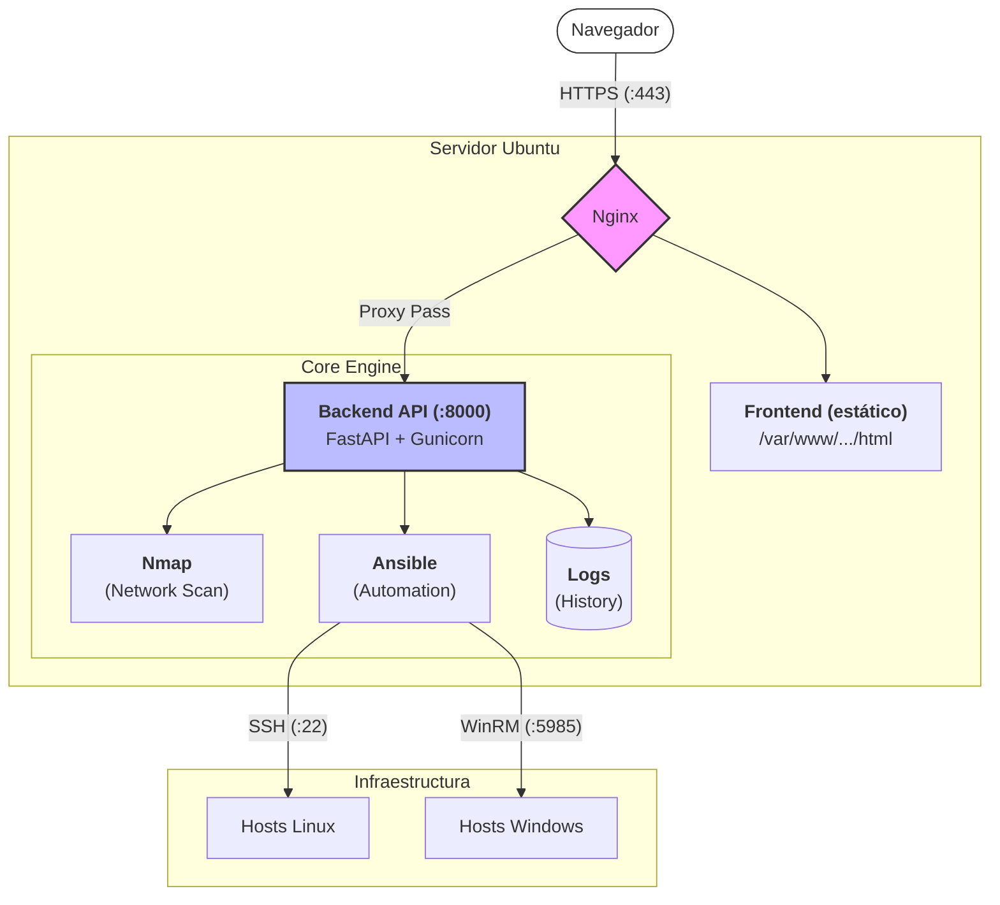

# Visual/\nsible - Gestion de Aulas con Ansible

Interfaz visual basada en nodos para gestionar y ejecutar playbooks de Ansible en aulas informáticas. Escanea la red, detecta equipos Windows y Linux, y permite ejecutar tareas de automatización con un simple arrastrar y soltar.

## Stack Tecnológico

| Capa | Tecnologia |
|------|-----------|
| Frontend | HTML5 + jQuery + AdminLTE 3 + Drawflow |
| Backend | Python 3.12 + FastAPI + Uvicorn/Gunicorn |
| Proxy | Nginx (con HTTPS y headers de seguridad) |
| Automatización | Ansible Core + WinRM + SSH |
| Escaneo | Nmap |
| Contenedores | Docker + Docker Compose |
| Seguridad | JWT + bcrypt + Fernet + HTTPS |

## Arquitectura



## Funcionalidades

- **Escaneo de red**: Deteccion automática de equipos Windows y Linux via Nmap
- **Playbooks predefinidos**: 10 plantillas listas para usar (instalación de software, firewall, usuarios, Docker, XAMPP, etc.)
- **Ejecución drag and drop**: Arrastra un playbook sobre un host y se ejecuta al instante
- **Streaming en tiempo real**: La salida de Ansible se muestra en el navegador mientras se ejecuta
- **Playbooks personalizados**: Crea y guarda tus propios playbooks desde la interfaz
- **Multiplataforma**: Soporta hosts Windows (WinRM) y Linux (SSH) simultaneamente
- **Logs de auditoría**: Historial completo de todas las ejecuciones

## Seguridad

- **Autenticación JWT**: Dos roles: `admin` (control total) y `operador` (solo lectura)
- **HTTPS obligatorio**: Puerto 80 redirige a 443 con certificado SSL
- **Credenciales cifradas**: `credentials.json` se cifra en disco con Fernet
- **Headers de seguridad**: HSTS, CSP, X-Frame-Options, X-Content-Type-Options
- **Contrasenas nunca en cliente**: Las contrasenas de los hosts viajan solo del frontend al backend, nunca al reves
- **Validación de entrada**: Regex en IPs, rutas, nombres de archivo y usuarios
- **Tokens efimeros**: JWT con expiracion de 24 horas

## Despliegue Rapido (Docker)

```bash
# Clonar repositorio
git clone https://github.com/JuanEntrena18/proyecto_ansible
cd proyecto_ansible/github

# Generar clave de cifrado para credenciales
export CREDENTIALS_KEY=$(python -c "from cryptography.fernet import Fernet; print(Fernet.generate_key().decode())")

# Construir y arrancar
sudo docker compose up -d --build
```

Accede a `https://<IP-del-servidor>` con usuario `admin` y contrasena `admin`.

## API REST

| Metodo | Endpoint | Auth | Descripcion |
|--------|----------|------|-------------|
| POST | `/login` | - | Inicio de sesion (devuelve JWT) |
| GET | `/me` | JWT | Informacion del usuario |
| GET | `/scan?subnet=X.X.X.X/XX` | JWT | Escanea una subred con Nmap |
| GET | `/playbooks` | JWT | Lista los playbooks disponibles |
| GET | `/playbooks/{tipo}/{nombre}` | JWT | Lee el contenido de un playbook |
| POST | `/playbooks` | Admin | Guarda un playbook personalizado |
| POST | `/execute` | Admin | Ejecuta un playbook en uno o varios hosts |
| GET | `/credentials` | Admin | Obtiene los usuarios configurados |
| POST | `/credentials` | Admin | Guarda credenciales de acceso a hosts |
| GET | `/logs` | Admin | Historial de ejecuciones |

## Playbooks Disponibles

| Playbook | SO | Descripcion |
|----------|----|-------------|
| `instalar_software` | Linux + Windows | Instala paquetes desde group_vars |
| `instalar_docker` | Linux | Instala Docker CE |
| `instalar_xampp` | Linux + Windows | Instala XAMPP / LAMP |
| `instalar_libreoffice` | Linux + Windows | Instala LibreOffice |
| `crear_usuario` | Linux + Windows | Crea usuario `alumno` |
| `configurar_acceso` | Linux + Windows | Configura SSH y WinRM |
| `configurar_firewall` | Linux + Windows | Abre puertos en firewall |
| `actualizar_sistema` | Linux + Windows | Actualiza paquetes del sistema |
| `renombrar_equipos` | Linux + Windows | Renombra equipos segun IP |
| `desinstalar_todo` | Linux + Windows | Desinstala todo el software instalado |

## Estructura del Proyecto

```
github/
+-- backend/
|   +-- main.py              # API FastAPI (JWT + cifrado)
|   +-- requirements.txt     # Dependencias Python
|   +-- Dockerfile           # Imagen del backend
+-- frontend/
|   +-- index.html           # Interfaz de usuario
+-- config/
|   +-- nginx.conf           # Proxy HTTPS con seguridad
|   +-- ssl/                 # Certificados SSL
|   +-- credentials.json     # Credenciales cifradas
+-- ansible/
|   +-- ansible.cfg          # Configuracion de Ansible
|   +-- inventory/           # Inventarios y group_vars
|   +-- playbooks/
|   |   +-- templates/       # Playbooks predefinidos
|   |   +-- custom/          # Playbooks del usuario
|   +-- roles/               # Roles de Ansible
|   +-- logs/                # Historial de ejecuciones
+-- scripts/
|   +-- backup.sh            # Backup automatico diario
+-- docker-compose.yml       # Orquestacion de contenedores
+-- README.md
```

## Variables de Entorno

| Variable | Descripcion | Obligatoria |
|----------|-------------|-------------|
| `CREDENTIALS_KEY` | Clave Fernet para cifrar credentials.json | Recomendada (se autogenera si no existe) |

## Despliegue Tradicional (sin Docker)

Consulta la [Guia de Despliegue](Guia_despliegue_0_5.ipynb) para instalacion en Ubuntu Server 22.04/24.04 sin Docker.

## Equipo

| Nombre | Rol | GitHub |
|--------|-----|--------|
| Juan Fco. Entrena Garrido | Desarrollo | [@JuanEntrena18](https://github.com/JuanEntrena18) |
| Diego Toribio Perea | Desarrollo | [@DIEGO1ASIRC](https://github.com/DIEGO1ASIRC) |
| Daniel Palacios Melguizo | Desarrollo | [@dpalmel1312](https://github.com/dpalmel1312) |
| Marina Jimenez Egea | Desarrollo | [@Marjieg](https://github.com/Marjieg) |
| Felix David Romero Lopez | Desarrollo | [@felixdavid28](https://github.com/felixdavid28) |
