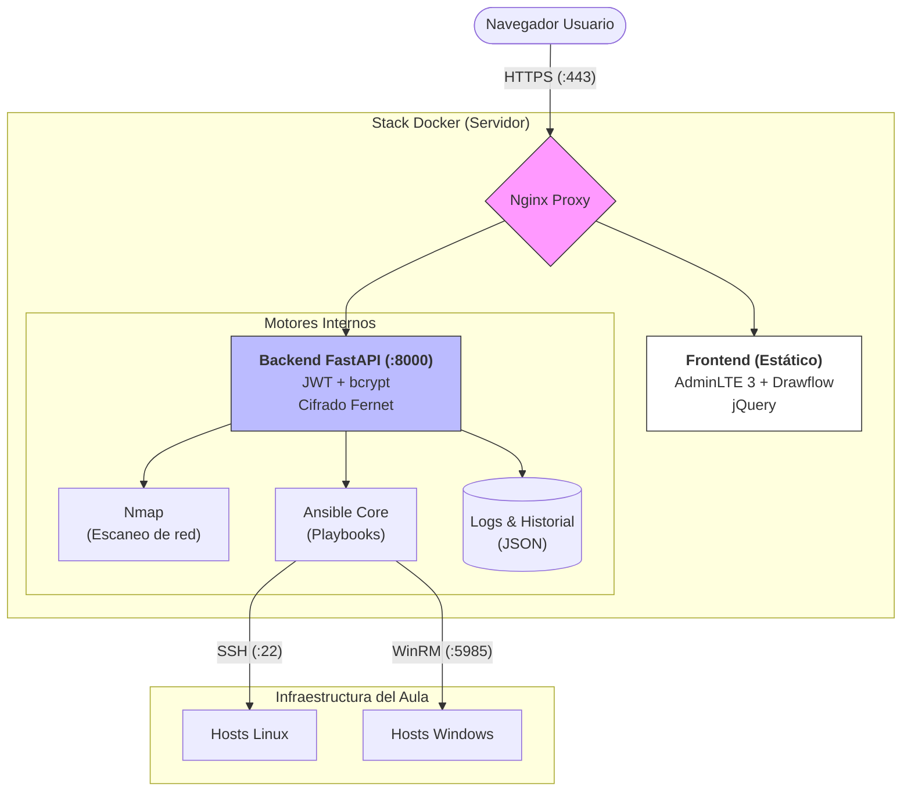

# Resumen Ejecutivo

## Visual/\nsible - Sistema de Gestión de Aulas con Ansible

---

### 1. Datos del Proyecto

| Campo | Valor |
|-------|-------|
| **Título** | Visual/\nsible - Interfaz Gráfica para Automatización con Ansible |
| **Curso** | 2º CFGS Administración de Sistemas Informáticos en Red |
| **Módulo** | Proyecto Integrado |
| **Centro** | IES |

---

### 2. Problema y Contexto

En un entorno de aula informática con decenas de equipos, las tareas repetitivas de instalación, configuración y mantenimiento consumen un tiempo valioso al profesorado. Herramientas como Ansible permiten automatizar estas tareas, pero su uso requiere conocimientos de línea de comandos, edición de archivos YAML y gestión de inventarios, lo que supone una barrera para muchos docentes.

**Visual/\nsible** nace para resolver este problema: proporcionar una interfaz visual e intuitiva que permita a cualquier profesor gestionar un aula completa sin escribir ni una línea de código, usando únicamente el ratón.

---

### 3. Objetivos

| # | Objetivo | Estado |
|---|----------|--------|
| 1 | Detectar automáticamente los equipos del aula mediante escaneo de red | Sí |
| 2 | Ejecutar playbooks de Ansible sobre equipos Windows y Linux | Sí |
| 3 | Proporcionar una interfaz visual tipo canvas con nodos arrastrables | Sí |
| 4 | Mostrar la salida de las ejecuciones en tiempo real (streaming) | Sí |
| 5 | Proteger el acceso con autenticación y cifrado | Sí |
| 6 | Garantizar la seguridad de las credenciales de los equipos | Sí |
| 7 | Empaquetar todo el sistema en contenedores Docker para un despliegue sencillo | Sí |

---

### 4. Arquitectura Técnica

**Componentes principales:**

| Componente | Tecnología | Función |
| :--- | :--- | :--- |
| **Proxy inverso** | Nginx sobre Alpine | HTTPS, seguridad, redirección |
| **Backend** | FastAPI + Gunicorn | API REST, autenticación, ejecución de playbooks[cite: 1] |
| **Frontend** | AdminLTE 3 + Drawflow + jQuery | Interfaz visual de usuario[cite: 1] |
| **Motor de automatización** | Ansible Core | Ejecución de tareas en equipos remotos[cite: 1] |
| **Escaneo** | Nmap | Descubrimiento de hosts en la red[cite: 1] |
| **Persistencia** | Volúmenes Docker + JSON plano | Credenciales, logs, playbooks[cite: 1] |
| **Contenedorización** | Docker Compose | Despliegue completo en un solo comando[cite: 1] |

### 5. Funcionalidades Clave

#### 5.1 Escaneo Inteligente de Red
Nmap detecta automáticamente equipos Windows (puerto WinRM 5985) y Linux (puerto SSH 22) en la subred del aula. Identifica la distribución mediante banners de servicio (Ubuntu, Debian, Raspberry Pi).

#### 5.2 Catálogo de Playbooks
Diez plantillas predefinidas que cubren las tareas más comunes en un aula:

| Playbook | Uso típico |
|----------|-----------|
| `instalar_software` | Desplegar paquetes en todos los equipos |
| `instalar_docker` | Preparar entorno de contenedores |
| `instalar_xampp` | Instalar servidor web local |
| `crear_usuario` | Crear cuenta de alumno en todos los equipos |
| `configurar_acceso` | Habilitar SSH/WinRM en equipos nuevos |
| `configurar_firewall` | Abrir puertos necesarios |
| `actualizar_sistema` | Mantener equipos actualizados |
| `renombrar_equipos` | Asignar nombre según IP (AULA-PCXX) |
| `desinstalar_todo` | Limpiar equipos al final del curso |

#### 5.3 Ejecución Drag & Drop
El profesor arrastra un playbook desde el menú lateral y lo suelta sobre la tarjeta del equipo destino. La ejecución se muestra en vivo mediante streaming, con indicadores visuales de éxito (verde) o error (rojo).

#### 5.4 Autenticación y Control de Acceso
Sistema JWT con dos roles:
- **admin**: Acceso completo (ejecutar playbooks, gestionar credenciales, ver logs).
- **operador**: Solo consulta (escaneo, listado de playbooks).

#### 5.5 Cifrado de Credenciales
Las contraseñas de los equipos se almacenan cifradas en disco con Fernet (AES). El frontend solo recibe indicadores de "contraseña configurada sí/no".

---

### 6. Seguridad Implementada

| Medida | Descripción | Impacto |
|--------|-------------|---------|
| **JWT con bcrypt** | Autenticación mediante tokens con expiración de 24h | Evita accesos no autorizados |
| **HTTPS obligatorio** | Puerto 80 redirige a 443 con certificado SSL | Cifra todo el tráfico |
| **Cifrado en reposo** | Credenciales cifradas con Fernet (AES) | Protección ante fugas de datos |
| **Roles de usuario** | admin / operador con permisos diferenciados | Mínimo privilegio |
| **Headers de seguridad** | HSTS, CSP, X-Frame-Options | Mitigación de XSS y clickjacking |

---

### 7. Resultados y Logros

- Sistema completamente funcional y desplegable con `docker compose up`.
- Compatibilidad nativa con entornos mixtos (Windows + Linux).
- Interfaz intuitiva que elimina la barrera técnica de Ansible.
- Seguridad de nivel producción mediante cifrado y protocolos seguros.

---

### 8. Trabajo Futuro

| Funcionalidad | Descripción |
|---------------|-------------|
| **Persistencia de esquemas** | Guardar la disposición visual de los equipos del aula. |
| **Playbooks visuales** | Crear flujos de trabajo arrastrando nodos sin escribir YAML. |
| **Estadísticas** | Panel con gráficos de tareas completadas y tiempos. |

---

### 9. Equipo de Desarrollo

| Nombre | Contribución |
|--------|-------------|
| **Juan Fco. Entrena Garrido** | Arquitectura, backend, seguridad, Docker. |
| **Diego Toribio Perea** | Playbooks de Ansible, integración OS. |
| **Daniel Palacios Melguizo** | Frontend e interfaz Drawflow. |
| **Marina Jiménez Egea** | Pruebas y documentación. |
| **Félix David Romero López** | Pruebas e integración continua. |

---
*Proyecto desarrollado durante el curso 2025-2026 para el módulo de Proyecto Integrado del CFGS ASIR.*
